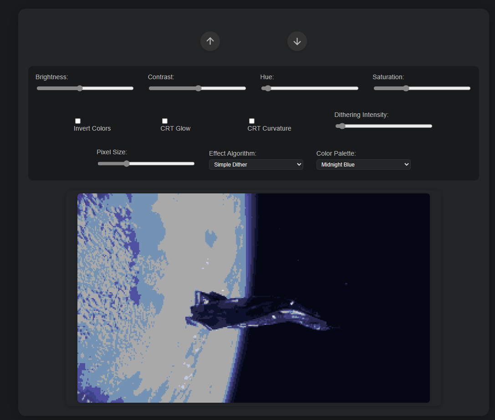

# Enhanced Pixel Art Converter

---
This project is a web-based pixel art converter that lets you transform images into pixelated art with a variety of retro palettes and effects.  
You can adjust brightness, contrast, hue, saturation, dithering, pixel size, and apply special effects like CRT scanlines, glow, and curvature.  
Choose from many color palettes inspired by classic hardware and modern aesthetics.

Since this is all done in the browser it can definitely get a little sluggish.

---
**It's currently hosted here:**
[https://spicy-bear.github.io/pixel/](https://spicy-bear.github.io/pixel/)

---
**Instructions:**
- Download
- Open the html file in your browser
- Upload and image

---
**Features:**
- Multiple color palettes (Game Boy, NES, Vaporwave, Synthwave, and more)
- Dithering and pixelation algorithms
- CRT/scanline and glow effects
- Brightness, contrast, hue, and saturation controls
- Download your pixel art as a PNG

---
**Screenshot:**  
The example below shows the "Midnight Blue" palette with simple dithering and CRT controls:

